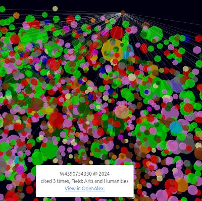

# Summary

Science can sometimes be complex. All of scientific work is based on referencing the work of others, and will be the reference for future works. 

Explore these relations by creating your own CitationNet. Or browse some of the existing once.
You will need an ID of a paper you are interested in and wait a minute or two. But be careful!
If the paper is very popular, the network will be too huge and the search takes a very long time!

# Statement of need

# Citations

Citations to entries in paper.bib should be in
[rMarkdown](http://rmarkdown.rstudio.com/authoring_bibliographies_and_citations.html)
format.

If you want to cite a software repository URL (e.g. something on GitHub without a preferred
citation) then you can do it with the example BibTeX entry below. @monastersky_2019:2019

For a quick reference, the following citation commands can be used: @vogl_2022_7346907:2023

# Figures

Figures can be included like this:
{ width=20% }
and referenced from text using \autoref{fig:example}.

# Acknowledgements

The development was originally part of the research project [ModelSEN](https://modelsen.gea.mpg.de)

> Socio-epistemic networks: Modelling Historical Knowledge Processes,

in Department I of the Max Planck Institute for the History of Science, Berlin, Germany
and funded by the Federal Ministry of Education and Research, Germany (Grant No. 01 UG2131).

The current iteration was created as part of outreach initiatives of the Max Planck Institute for Geoanthropology, Jena, Germany

We furthermore acknowledge code review of the previous code version by [Rebecca Sutton Koeser](https://github.com/rlskoeser) (Princeton University)
and [Raff Viglianti](https://github.com/raffazizzi) (University of Maryland) , facilitated by Julia Damerow (Arizona State University) with support of the [DHTech Community Code Review Working Group](https://dhcodereview.github.io/). 

# References
