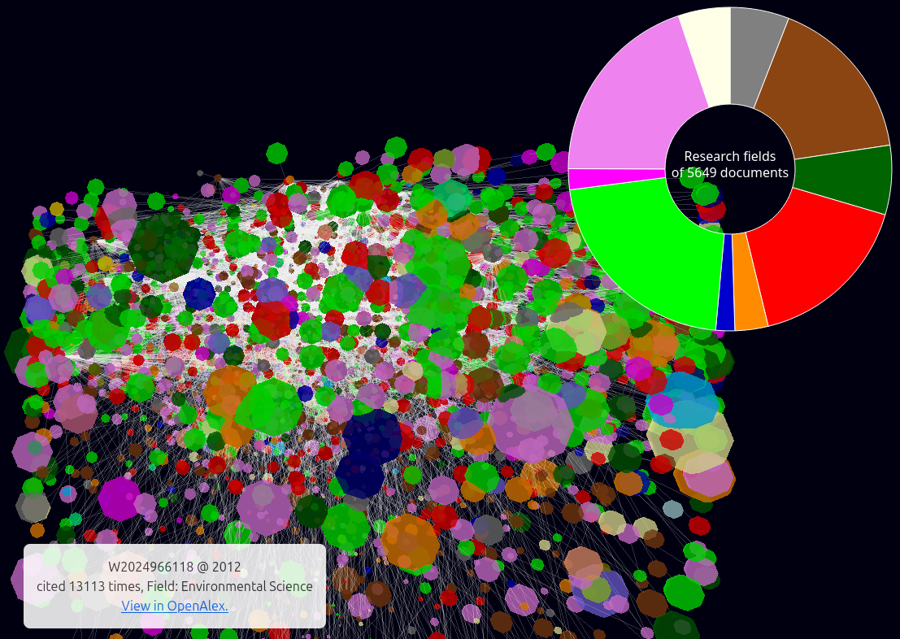

# Summary

This package provides a query and visualization interface to the [OpenAlex](https://openalex.org/) repository, an open-science knowledge database. For a source publication, the references and citations are extracted (first level). In a second step the references for each of the in level one retrieved references are extracted, as well as the citations of the in level one retrieved citations (second level). The full data is then displayed as a 3D Graph that connects eahc publication to their respective references and citations.

Each node of the graph corresponds to a single publication. The color of the node is set by the primary [topic](https://docs.openalex.org/api-entities/topics/topic-object) of the publication and the size is given by the number of citations that publication has accumulated since its publication. 

The nodes are arranged in cylinder coordinates such that the publication time is the z-Axis, i.e. earlier years are to the bottom of the graph. All publications of a given year are arranged on a disk, such that publications at the periphery have a higher number of citations.

The visualization is fully interactive and allows zooming, panning and rotating the graph By clicking on a node a small info box is shown, that allows to access the original data entry at OpenAlex.

{ width=40% }

The interface additionally allows to open a pie chart showing the relative amounts of research topics present in the collected publications. 

# Statement of need

The purpose of this software is to show to scholars and the general public the complex network of scientific publications in a visual manner. For science outreach purposes the tool allows to browse the network of science, e.g. related to publications of a given institution or specific researchers. For scholars in fields like history of science the tool can give valuable insights on the influence of ideas, i.e. how knowledge transitions between disciplines. 

# Related work

The package is based on the [3D Force Graph](https://github.com/vasturiano/3d-force-graph) package by Vasco Asturiano (3D Graph) and [D3.js](https://github.com/d3/d3) by Mike Bostock and Contributors (Pie chart). An earlier version of the package is published at Zenodo[@vogl_2022]. For an introduction to the background of the ModelSEN project, referece to [@sen_2024].

# Documentation

The query interface of the software is published as a [package](https://pypi.org/project/citationnet/) on PyPI. The 3D visualization is available as a [NPM package](https://www.npmjs.com/package/citationnet). The full documentation is hosted on [ReadTheDocs](https://citationnet.readthedocs.io). The complete source code is available on [Gitlab](https://gitlab.gwdg.de/mpigea/dt/citationnet).

# Acknowledgements

A first version of this package was inspired by the visualizations in celebrating [150 years of Nature](https://www.nature.com/immersive/d42859-019-00121-0/index.html) [@monastersky_2019]. It was developed in collaboration with Robert Egel for the research program on the [history of the Max Planck Society](https://gmpg.mpiwg-berlin.mpg.de) using [DimensionsAI](https://www.dimensions.ai/) data and field of research classification.

The development was then continued as part of the research project [ModelSEN](https://modelsen.gea.mpg.de) in Department I of the Max Planck Institute for the History of Science, Berlin, Germany and funded by the Federal Ministry of Education and Research, Germany (Grant No. 01 UG2131).

The current iteration was created as part of outreach initiatives of the Max Planck Institute for Geoanthropology, Jena, Germany

We furthermore acknowledge code review of the previous code version by [Rebecca Sutton Koeser](https://github.com/rlskoeser) (Princeton University)
and [Raff Viglianti](https://github.com/raffazizzi) (University of Maryland) , facilitated by Julia Damerow (Arizona State University) with support of the [DHTech Community Code Review Working Group](https://dhcodereview.github.io/). 

# References
